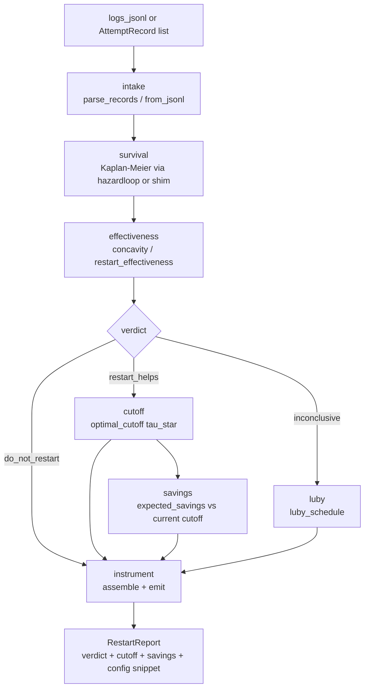

# restartwell

[](https://github.com/hinanohart/restartwell/actions/workflows/ci.yml)
[](LICENSE)

> Offline renewal-reward **restart-cutoff** instrument for agent attempt-cost logs.

`restartwell` takes a list of agent attempt costs (tokens or wall-clock seconds) plus
outcome labels (`success` / `timeout` / `fail`) and answers one question with a
fail-closed verdict:

> *Given how your agent's cost-to-success is distributed, should you restart on a finite
> cutoff — and if so, what cutoff minimises expected cost-per-success?*

It emits a cost-optimal restart cutoff **τ\*** with a bootstrap confidence interval, the
expected **savings** versus your current timeout and versus a naive p90 cutoff, and a
paste-able config snippet for common agent frameworks. When the evidence does not support a
precise cutoff it falls back to a **Luby** universal schedule rather than fabricate one.

`restartwell` is an **offline measurement instrument**, not a runtime daemon: it reads logs
and emits a decision + config. It does not run, retrain, or live-control your agent.

---

## Architecture



The `survival` module is the **only** layer that imports `hazardloop`; the rest of the
pipeline is decoupled from the survival backend and works with the bundled standalone shim
when `hazardloop` is unavailable. This boundary is enforced by `import-linter`.

---

## Why

Agent runtimes are heavy-tailed: most attempts finish fast, a few hang and burn the budget.
When the cost-to-success hazard is *decreasing*, cutting a hung attempt and restarting gives a
fresh shot at a fast success — the classical Las-Vegas restart result. Most agent stacks pick
a timeout by hand and retry with exponential-backoff folklore. `restartwell` applies the
30-year restart toolbox (Luby universal schedule; fixed-cutoff renewal-reward optimality; the
decreasing-hazard restart criterion `E[A] < E[A − t | A > t]`) to your actual cost logs.

---

## Boundary

[`hazardloop`](https://github.com/hinanohart/hazardloop) estimates the hazard **shape**
(Kaplan-Meier / Nelson-Aalen). `restartwell` consumes that shape and ships only the restart
**decision + cutoff config** layer on top. Both are MIT. `restartwell` does not re-implement
`hazardloop`'s survival estimators (enforced by import-linter).

---

## Install

```bash
pip install "restartwell @ git+https://github.com/hinanohart/restartwell"
```

`restartwell` depends on `hazardloop` (a pinned commit) for the survival primitives. If that
git dependency cannot be fetched, a bundled standalone KM/NA shim activates automatically.

---

## Quickstart

### CLI

```bash
# logs.jsonl: one JSON object per line, e.g. {"cost": 5200, "label": "success"}
restartwell report --input logs.jsonl --unit tokens --r 1500 --current 8000
```

`--r` is the per-restart overhead in the same unit as `cost`. It is required — it is exactly
what moves τ\* off a naive percentile.

### Python API

```python
from restartwell import analyze, AttemptRecord

attempts = [AttemptRecord(cost=c, label=l) for c, l in my_log]
report = analyze(attempts, r=1500, unit="tokens", current_cutoff=8000)

print(report.verdict.decision)          # restart_helps | do_not_restart | inconclusive
if report.cutoff:
    print(report.cutoff.tau_star)       # the renewal-reward optimal restart cutoff
if report.savings and not report.savings.suppressed:
    print(report.savings.savings_fraction)
```

### Per-cohort analysis

```python
from restartwell import analyze_by_cohort

# Each AttemptRecord can carry a cohort= field (e.g. model x harness x task-bucket).
# analyze_by_cohort runs analyze() per cohort and returns a dict keyed by cohort name.
reports = analyze_by_cohort(attempts, r=1500, unit="tokens")
```

---

## What it reports

| Field | Description |
|---|---|
| **Verdict** | Fail-closed 3-way: `restart_helps`, `do_not_restart`, or `inconclusive` |
| **τ\*** | Renewal-reward optimal cutoff minimising `E_total(τ) = (E[min(A,τ)] + r·P(A>τ)) / P(A≤τ)`, with bootstrap CI and p90/p95 baselines |
| **Savings** | Expected cost-per-success of τ\* vs your current cutoff and vs p90; suppressed when CI straddles zero |
| **Config** | Paste-able cutoff snippet for LangGraph / CrewAI / SWE-agent / opencode |

### Verdict logic

- **`restart_helps`** — hazard is decreasing; a finite cutoff beats waiting forever.
- **`do_not_restart`** — hazard is increasing (wear-out regime); raise the timeout instead.
- **`inconclusive`** — too few successes or no resolvable trend; a Luby universal schedule is returned in place of a point cutoff.

---

## Illustrative result

On a held-out **synthetic-faithful** heavy-tail (decreasing-hazard) mixture
(`n_held = 600`, `seed = 0`, `r = 400`, `n_boot = 1000`, hazardloop backend), τ\* fit on the
training split reduces expected cost-per-success on the held-out split by **≈ 57 %** versus
the data-generating timeout and **≈ 55 %** versus a naive p90 cutoff (95 % CI **[52.7 %,
60.6 %]**). These numbers are **illustrative** — measured on a synthetic mixture with known
ground truth, not a benchmark claim about any real system. They are regenerated by
`python -m restartwell.bench.harness` and recorded in
[`results/v0.1.0a2_metrics.json`](results/v0.1.0a2_metrics.json). No redistributable real
agent-cost log is bundled.

---

## How it works

1. **Intake** (`restartwell.intake`) — parses JSONL or `AttemptRecord` objects; validates cost (finite, ≥ 0) and label.
2. **Survival** (`restartwell.survival`) — fits a Kaplan-Meier curve on the cost-to-success axis via `hazardloop` (or the bundled shim). This is the **only** module that touches `hazardloop`.
3. **Effectiveness** (`restartwell.effectiveness`) — tests whether the empirical hazard is decreasing (restart helps), increasing (do not restart), or indeterminate (inconclusive).
4. **Cutoff** (`restartwell.cutoff`) — when verdict is `restart_helps`, numerically minimises the renewal-reward objective `E_total(τ)` over a grid; computes a cluster-bootstrap CI.
5. **Savings** (`restartwell.savings`) — estimates cost-per-success at τ\* vs current cutoff; suppresses the estimate when the bootstrap CI straddles zero.
6. **Luby** (`restartwell.luby`) — when evidence is inconclusive, returns a Luby universal schedule anchored at the median success cost.
7. **Emit** (`restartwell.emit`) — formats a paste-able config snippet for common agent frameworks.
8. **Instrument** (`restartwell.instrument`) — `analyze()` wires all of the above into a single `RestartReport`; `analyze_by_cohort()` runs it per cohort.

---

## Non-claims

`restartwell` does **not** estimate hazard shape (use `hazardloop`), compute pass@k (use
`passwedge`), or run/retrain/live-control your agent. The renewal-reward / Luby results hold
for **serial** restart-or-wait only; parallel best-of-n is out of scope for v0.1. See
[`docs/CLAIMS.md`](docs/CLAIMS.md) for the full CLAIM / NON-CLAIM boundary.

---

## Prior art

The restart theory `restartwell` packages is classical and cited honestly:

- M. Luby, A. Sinclair, D. Zuckerman, *Optimal speedup of Las Vegas algorithms* (1993).
- M. Gagliolo, J. Schmidhuber, *Learning restart strategies* (IJCAI 2007).
- Renewal-reward / restart-cutoff treatment in T. Vieira's restart-strategy notes and arXiv:1709.10405.
- *Restart Strategies in a Continuous Setting* (2021) — Luby's worst-case optimality is a discrete result and does not transfer verbatim to continuous cost.

`restartwell`'s contribution is the packaging: serial restart theory applied to agent
attempt-cost logs as an offline decision + cutoff-config instrument, on top of `hazardloop`.

---

## Status

Pre-alpha (`v0.1.0a2`). CPU-only, no model weights. Python ≥ 3.11.

---

## License

MIT.
